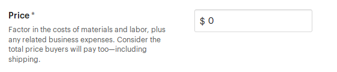
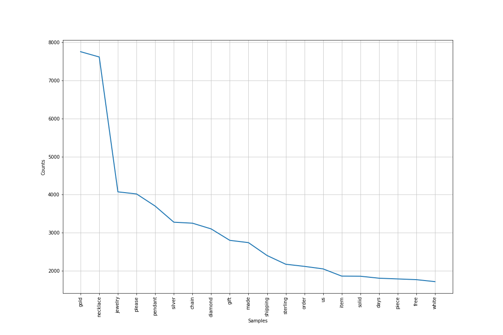
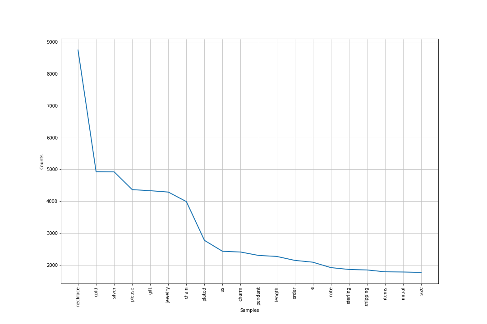
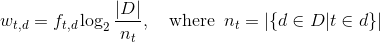
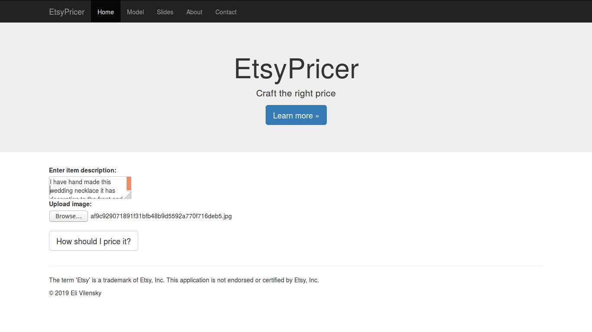
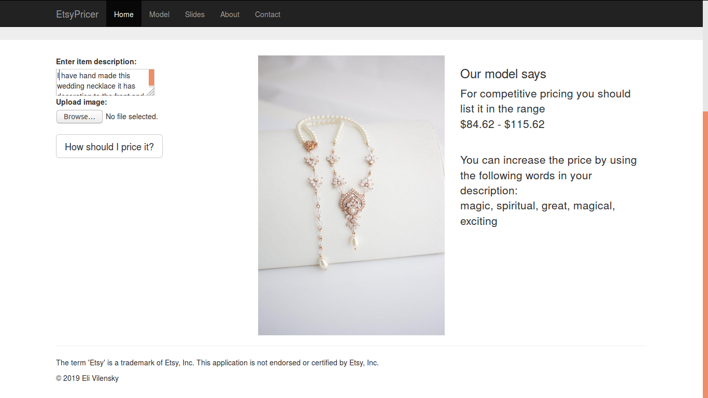

# EtsyPricer - Craft the Right Price

## About the project

EtsyPricer is a web application that provides estimates of competitive pricing for handmade items made by Etsy sellers and gives recommendations for improved item descriptions. This application uses a text description and an image uploaded by the user as inputs for a machine learning model trained on historical data. The application was built in two weeks as part of the Insight Data Science program. It uses Python, Flask, AWS and SQL. The live version is available at http://etsypricer.host.

## Project motivation
Etsy is an online marketplace that helps makers sell handmade items. It has been growing at a signficant pace, amassing almost 2M sellers. Last year it has added 180,000 sellers, so almost one in ten of Etsy sellers are new to the platform. As a new seller, one faces the challenge of pricing items competitively. Etsy achieved $922.5M GMS (gross merchandise sales) in Q3 2018 from which we can estimate that almost 40M items were sold on its marketplace. Assuming that new sellers accounted for 10% of those sales, sellers underpricing by $1 would lose out on $4M in sales revenue. Such a mispricing would also have a negative impact on Etsy revenue given that Etsy charges 5% fee on each sold item.

When a new seller adds a listing to Etsy, they are prompted to enter the price:

This prompt provides some advice for new sellers, namely to factor in the cost of the materials and labor, and suggests they do market research. This can be a tall order for hobbyists who are just starting out on Etsy. Furthermore, makers often underestimate the value of their handmade items. One can find many Etsy sellers frustrated by the lack of good pricing advice. Often an Etsy seller would price their item by just looking at a few similar items and averaging their price. My web application provides a quantitative estimate for the price of an item as well as gives a recommendation for improving item descriptions.

## Data
As a proof-of-concept, the category of items was restricted to necklaces. There are 3M+ necklace listings on Etsy which can vary in the materials used, whether they include precious stones, as well as the prices they can fetch on the marketplace. Over 10,000 listings were used in building the model. The price categories (under $25, $25-50, $50-100, over $100) were balanced when sampling the data. The data obtained from each listing included the following features:

* Item name
* Item description
* Item overview
* Item price
* Item rating
* Number of ratings
* Item image

The items priced above $500 comprised about 3% of the total number collected and they were classified as outliers and removed from analysis. It was clear that the price would depend on the materials used for making the item. Therefore, I had to extract the materials from an item overview if the seller has included this section or from an item description if not. Then I engineered corresponding categorical features. 

## Modeling
In the first modeling approach I used the item description to estimate the price. The item description was cleaned and preprocessed by removing urls, deleting non-alphanumeric characters and stopwords and tokenizing the text. To obtain a feature vector from a text there are a number of different approaches:

1. Bag-of-Words (BOW) method: this method counts the frequency ft,d of each word t in description d and creates a vector of counts for each of the words used. Here are the top twenty most used words in the descriptions of expensive items (over $100):

And here are the top twenty most used words in the descriptions of inexpensive items (under $25):

We can see that the word diamond for example frequently appears in the descriptions of expensive items while it does not appear in the descriptions of low-priced items. One can also note the appearance of the word "solid" in the first graph and its counterpart "plated" in the second graph. However, because some words are used much more frequently than others in our dataset (for example, the word "necklace"), it is clear that such frequent words should be discounted in our analysis which led us to the next approach.

2. Term frequency-Inverse document frequency (Tf-Idf) method: this method similarly to the BOW method assigns a vector of coefficients wt,d for each of the words t used in description d but now each coefficient is scaled down for more frequently used words in the corpus D:

The feature vectors generated from the text descriptions using the tfidf method were then used as inputs for a pricing model. The linear regression model is a simplest method that could be used for price prediction and is easy to interpret but it was inadequate for the task at hand:
* Linear regression assumes linear relationship between predictors and the target variable while we observe non-linearities in the data.
* The size of the feature vectors generated using gensim implementation of the tfidf method was comparable to the size of the dataset - this would lead to significant overfitting using linear model.
* Linear regression does not appropriately account for the categorical variables which could foreseeably be added to the model

Therefore, instead of the linear regression, I applied k-nearest neighbors regression using cosine similarity between tfidf descriptions to characterize nearest neighbors. To evaluate the model I used the mean absolute percentage error (MAPE). This was because root mean square error customarily used in regression problems is sensitive to the scale of the target, and $5 RMSE on items priced around $10 has different significance to $5 RMSE on items priced around $100. Using a held-out validation set with the size of 20% of the whole dataset, the knn regression achieved 56% improvement over the baseline model of predicting the average price in the category.

### Improved model 
One avenue for improvement that was available to me was to include additional features for my model, in particular the images as well as the categorical features encoding the materials used. The improved model was built using a random forest. Because the number of features generated by the tfidf method was larger than the size of the dataset, I considered techniques for dimensionality reduction. While SVD (singular value decomposition) is commonly used to reduce dimensionality and produce a semantic model from a sparse tfidf matrix, more recently word2vec embeddings (derived from neural networks) have been found to perform better on analogies tasks. It has been conjectured that this better performance stems from the fact that word2vec embeddings use implicit weighted matrix factorization which assigns larger weights to more frequently occuring word-context pairs unlike equal weights assigned by SVD [1]. Furthermore, all of these models are limited because they represent the text as unordered collection of words. 

A better model is the Doc2Vec algorithm: this method uses a shallow neural network to train vector embeddings for texts in the corpus. This method can be used to determine semantic similarity between item descriptions. After transforming descriptions to feature vectors using the Doc2Vec model I have determined the top k (for k=5) similar items using cosine similarity and used these items' cosine similarities and prices as features for my model. Categorical features using one-hot encoding were used to represent the materials used as well as whether the item was vintage or handmade.

The images were transformed into feature vectors (1280 components each) by using a pretrained convolutional neural network in Keras with the TensorFlow backend. The CNN used is MobileNetV2 which has been developed at Google [2] to run on mobile devices. It is competitive with other CNN architectures on image classification, object detection and image segmentation tasks while using smaller number of parameters and Multiply-Add operations. MobileNetV2 architecture was used with the weights pre-trained on the ImageNet dataset. To obtain feature vectors the top softmax layer of the classifier CNN was removed and the features were extracted from the pooling layer. The image feature vectors were used to determine the top k (for k=5) similar items using cosine similarity and these items' cosine similarities and prices were included as features for my model.

The performance of the improved model on the test set was measured using MAPE and it was found to outperform the baseline model by 73%. Furthermore, using the ten most similar items determined per above procedure, the application finds words that are used in the descriptions of the items that are priced higher than the predicted price and suggests to the user to use these words to achieve higher pricing.

## Web application
EtsyPricer is available as a web application hosted on http://etsypricer.host.

### Screenshot of user entry

### Screenshot of app output

Using the output page, Etsy sellers can work the recommended words into their description and craft their way to the right price!

- - - -
[1] Levy, Omer and Yoav Goldberg. “Neural Word Embedding as Implicit Matrix Factorization.” NIPS (2014): 2177-2185.

[2] Sandler, Mark B. et al. “MobileNetV2: Inverted Residuals and Linear Bottlenecks.” 2018 IEEE/CVF Conference on Computer Vision and Pattern Recognition (2018): 4510-4520.

